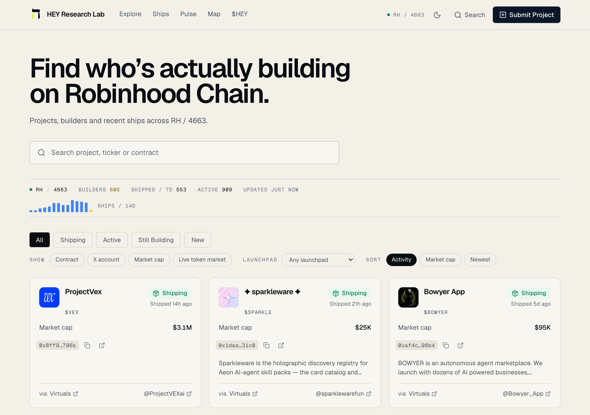
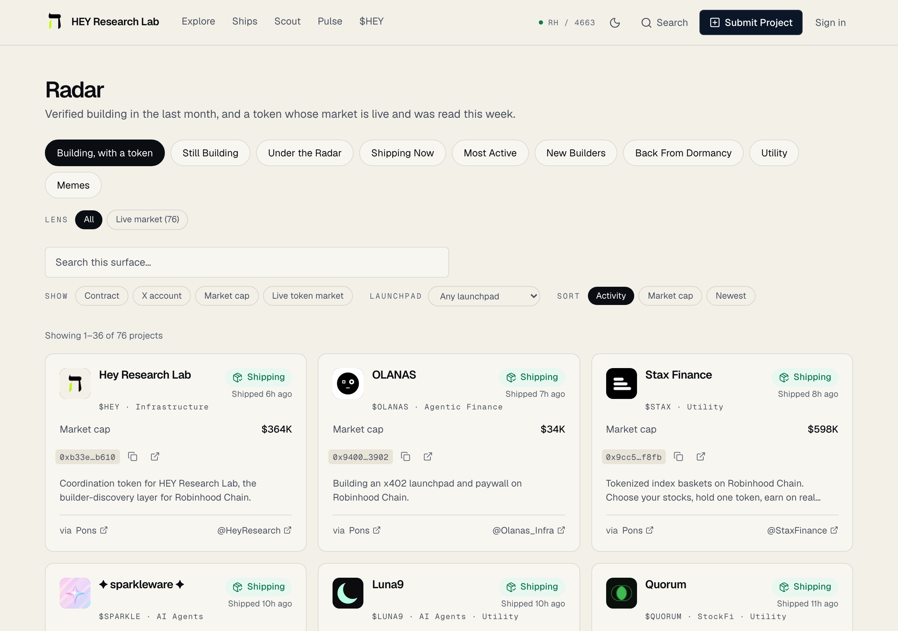
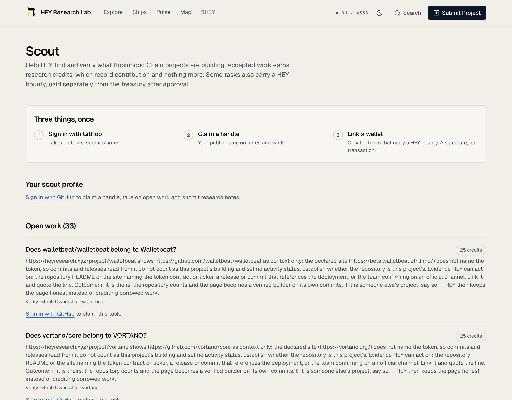
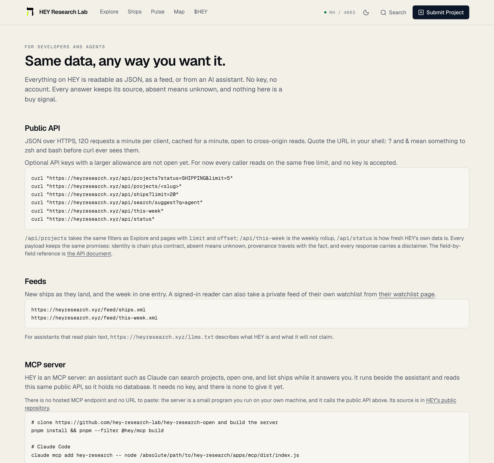
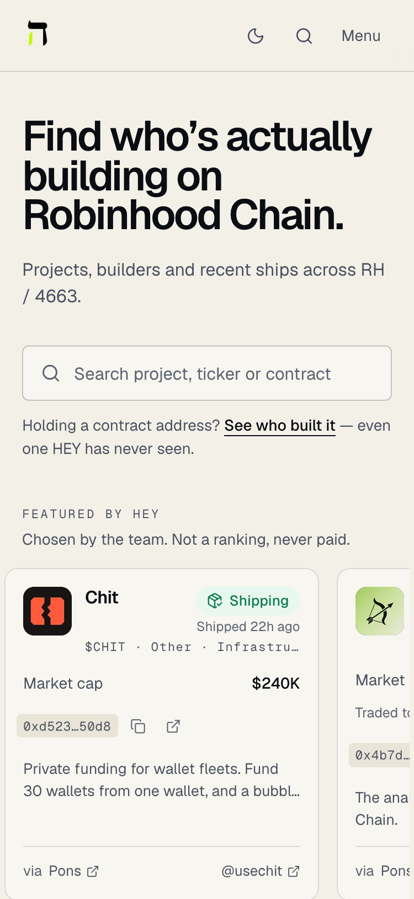

# HEY Research Lab — open source

The published part of [HEY Research Lab](https://heyresearch.xyz), the builder-discovery
layer for Robinhood Chain. HEY answers one question: **which projects are still building,
what have they shipped, and which of them is nobody looking at?**

This repository holds the parts of HEY that are useful on their own and safe to read:

| Path | What it is |
| --- | --- |
| `packages/sources` | Every public-data adapter HEY reads (GitHub, Blockscout, DEX Screener, GeckoTerminal, CoinGecko, launchpads, feeds), each with saved fixtures and contract tests. No network in tests. |
| `packages/scoring` | The deterministic activity status, Build Momentum, Still Building and Under the Radar rules, versioned. Scores never read price or holdings. |
| `packages/config` | Environment schema and chain constants. |
| `packages/ui` | The presentation components (cards, chips, formatting). |
| `apps/mcp` | The MCP server: twelve tools an assistant can call, over the public API. |
| `docs/` | The public API, the MCP server, the source registry, and every data source HEY reads with what it refuses and why. |

The ingestion pipeline, the quality gate, the database schema, the web app and the operations
tooling stay in the private repository. Nothing here contacts a provider: the adapters take an
injected `fetch`, and the tests fail on any real network call.

## What HEY looks like

Captured from [heyresearch.xyz](https://heyresearch.xyz) on 11 September 2026.

| Home | Project |
| --- | --- |
|  |  |

| Radar | Scout |
| --- | --- |
|  |  |

| Developers | Mobile |
| --- | --- |
|  |  |

A link on a project page carries one of four labels, and the bottom two are not the same thing:
**Verified** (HEY confirmed the project controls it), **Official** (HEY found it published on the
project's own domain), **Declared by the project** (someone put their name to it on a submission a
moderator approved) and **Unverified** (HEY found it and nobody has stood behind it). A project can
be a verified builder while its links are only declared — the badge is about what was shipped, the
label is about who says the link is theirs.

A project page shows three facts apart: development (from the project's own sources), the
token's market status (active, low or no liquidity, trading inactive, liquidity removed, or
insufficient data) and whether the token is verified as the project's own. Scores read the
first and never the other two.

Explore has two views (2026-09-12): **Projects**, everything HEY tracks, and **With a token**, only the projects with a token, with a Market Lens — live market, verified token, launch stage (on the curve, graduated, in a DEX pool), a liquidity floor, liquidity and 24 h volume orders — and one line under every market sort saying how many rows actually carry the figure. Market figures stay context; nothing ranks by them, and tokenless builders are never hidden from the first view. A token card HEY cannot read building from says "No builder signal yet" and prints what HEY does know — traded today, on-chain events, the pool it trades in — as context (2026-09-13); trading is not building. Since 2026-09-13 HEY keeps its own daily index (`token_market_days`, `chain_activity_days`): every token project has a market page (`/project/{slug}/market`, `/api/projects/{slug}/market`) with price, liquidity, trades and volume day by day, the lifecycle and what HEY checked on the contract, and Pulse shows Robinhood Chain day by day (`/api/chain`). Counts, never accounts — until 2026-09-14, when that changed for one thing only; see **What HEY does not do** below. Nothing in scoring reads any of it. HEY Signal (`/signals`) turns measured changes into a feed with before/after figures and sources; the Builder Radar (`/builders`) ranks builders by verified development, on-chain use and research standing, never by price; weekly reports are archived at `/reports/weekly` (2026-09-13). Since 2026-09-14 a market page also carries **token distribution**: a bubble map of the largest balances drawn to scale, with pools, launchpad lockers and burned supply named and kept out of the concentration figure, and circles that moved the token between each other coloured as a group. Every circle links to that address on the block explorer. The same day, contract usage moved to a batched read — calls, transactions, and how many different method names and event names a contract saw — so a token that is only being traded (three or four methods) reads differently from a contract people call. An audit the same evening found the denominator behind every share of supply was wrong: it divided by a fully diluted valuation, which on this chain is supply net of the burn address, so shares were inflated by the burned fraction and twenty-eight token-days summed past 100%. The denominator is now read from the token contract (`packages/sources/src/adapters/erc20-supply.ts`), a token whose contract will not answer is skipped rather than mapped against a guess, and shares that still fail to reconcile are published as no figure rather than a wrong one. The same read now guards the market figures: a reading is refused before it is stored if the pool is worth less than one whole token at the price quoted, if the market cap exceeds the fully diluted valuation of the same token, or if the supply the reading implies disagrees with the contract by more than a factor of two — three checks that between them caught a $7.3 septillion market cap, a bridged asset's global cap published as this chain's, and a price of $265.64 beside a market cap of $3,277. Liquidity and volume are summed across the token's pools rather than taken from the deepest one alone. Since 2026-09-15 each day also carries counts of the addresses behind the numbers — how many called a contract, how many traded a token, how many bought and how many sold — and a token's concentration as a Gini coefficient and a Nakamoto coefficient, the number of addresses holding more than half the supply. All of them are counts the provider computes and returns as numbers; none of them selects, stores or names an address.

Since 2026-09-15 HEY answers the same question for a **single contract address it has never
seen**, at [heyresearch.xyz/scan](https://heyresearch.xyz/scan): *is anyone building this?* Every
other scanner on the chain answers whether a token will rug — holders, wallet clusters, honeypot
simulation, liquidity locks — so this sits beside them rather than against them, and the two do
not overlap at any point: HEY reads no holders and no wallets here at all. The report is facts
with the source behind each, in three groups — who built it, what is being built, and what HEY
cannot see — with **no score, no count of passed checks and no colour**, because one number is
all it takes for a reader to take a scan box as a safety rating. Absences are named as absences.

Two reads in `packages/sources` were added for it, both from Bitquery's decoded chain. The
first (`bitquery-deployment.ts`) reads the contract's creating call, which carries two accounts
a block explorer reports as one: what executed the creation — a factory, for a launchpad token —
and the account that sent the transaction, which is what a reader means by "who built it". The
second (`bitquery-surface.ts`) reads **which methods the contract answers**, and for the many
addresses that declare no website and no repository it is the only evidence there is: a plain
token answers `balanceOf`, `transfer`, `approve` and little else, while a protocol answers a
surface somebody designed. Neither is judged — a plain token is an ordinary and honest thing to
be — and a caller count is a count of distinct senders, never resolved to an address and never
stored. The realtime window is about four days, so a quiet contract reads as a quiet window
rather than an empty contract. `packages/sources/src/factories/registry.ts` also gained
`LAUNCH_ROUTERS`: contracts that front a launch factory rather than being one, so a launch made
through a launchpad's own router is named for the launchpad, and one batched through a generic
contract like Multicall3 is named as exactly that.

## What HEY does not do

For its first year HEY stored nothing about who holds a token. Product rule 1 forbade holder
tracking outright and a schema test failed the build if a table or column so much as contained
the word.

**That boundary moved on 2026-09-14**, by the founder's decision, for one shape and no further:
a bubble map of a single token's largest balances, on the market page, behind the builder story,
so a reader can see five hands holding most of a supply before deciding anything. An address
there is a point on a chart of one token's supply. It is never a person, never scored, never
ranked across tokens, never followed, and never an input to activity status, Build Momentum, the
Discovery Gap or the Builder Radar.

Everything else the rule forbade, it still forbids, and the schema guard still enforces it:
no wallet PnL, no smart-money labels, no whale labels, no wallet profiles, no wallet clustering
presented as a claim about people, no copy-trading. The word `holder` is permitted on exactly
three tables and nowhere else; `wallet`, `pnl`, `smart_money`, `whale` and `copy_trade` still
fail the build anywhere, in the schema, in the migration SQL and against a live database.

A cluster on that map means one thing and says only that: these addresses moved this token
between each other in the last few days. It is a fact about transfers inside a window HEY can
see. It is not a claim that anyone is the same person, and HEY does not decide what it means.

HEY also still publishes no verdicts. A project page states findings and where each came from,
and the words *rug* and *scam* appear nowhere in the product — an end-to-end test asserts it.

## The token, briefly

`$HEY` (contract `0xB33eb16782776b4D738c0Fd643577cb0284Db610` on Robinhood Chain) pays for
evidence. Bounties are set in dollars ($10 / $25 / $50 by tier) and paid in HEY at a figure
quoted once from HEY's own price reading, half at approval and half ninety days later if the
evidence still stands; a new bounty opens to holders first for 24 hours. Holding changes what a
reader pays, when they read new research and how much the API serves them. It never changes a
ranking, a status or a score: the rules in `packages/scoring` read no price and no balance, and
that is tested. Nothing on HEY is a buy signal.

## Use

```bash
pnpm install
pnpm lint && pnpm typecheck && pnpm test
pnpm --filter @hey/mcp build   # apps/mcp/dist/index.js, the MCP server
```

The MCP server runs on your machine and reads `https://heyresearch.xyz/api`; see
[docs/MCP.md](docs/MCP.md). The API itself is documented in
[docs/PUBLIC_API.md](docs/PUBLIC_API.md).

Building something that meets a contract address rather than a slug — a bot where someone
pastes a CA and wants one line about it — `GET /api/token/{chainId}/{address}` answers it in
one call (2026-09-16): activity status with the words the site itself uses, ships in the last
thirty days counted as the project page counts them, the last ship with its source, and a link
back. An address HEY has no published page for answers `200` with `status: "unknown"` rather
than a 404, because most addresses pasted anywhere are not published projects. No key needed.

The full guide — the line to render, the three answers to handle, and the four things not to do —
is [docs/INTEGRATIONS.md](docs/INTEGRATIONS.md), also on the site at
[heyresearch.xyz/developers/integrations](https://heyresearch.xyz/developers/integrations).

Two small corrections to that endpoint (2026-09-17): the address prefix is read in either case
(`0X…` is what some explorers print) and the chain id is the plain integer `4663` — `4663.0` and
`04663` are refused rather than treated as the same chain, so a token has one URL. The MCP
server's `this_week` tool now renders the real weekly rollup; its first version answered every
call with an error, which the captured fixture in `apps/mcp/src/fixtures/` now guards against.

The site's own metadata was consolidated the same day (2026-09-17): one builder for title,
description, canonical and share card, project titles that name the chain, share images that carry
the narrative and the latest ship, a complete sitemap, and a public roadmap at
[heyresearch.xyz/roadmap](https://heyresearch.xyz/roadmap) that describes the platform as it runs. The roadmap was rebuilt on 2026-09-18 as four quarters on one dependency ladder — research, then signals, then a Telegram Shipping Signal Agent, then an agent and execution network — with every line marked LIVE, SHIPPED, IN PROGRESS, PLANNED or RESEARCH from an inventory of the code; the audit behind it and the architecture plan for the signal and the agent are served at `/docs/roadmap-audit` and `/docs/shipping-signal-architecture`.

A second findings pass the same evening (2026-09-17) changed four things an integrator sees: the
dossier at `GET /api/projects/{slug}` now carries its newest five `ships` and, whenever it claims
`stillBuilding`, the `stillBuildingEvidence` behind the claim; a bare contract deployment is a
launch, not a ship, on every ship surface (the project page's own timeline still shows it);
`/api/projects` pages no longer overlap or drop rows inside ties, so a full walk by offset returns
each project once; and the per-client rate limit is consumed before any key is looked at, so an
unknown bearer is limited like everyone else. Still Building is measured against a daily *close*
at least a week old, never an intraday high. A third pass the same evening added: `/api/ships` never
hands back an offset the cap will clamp; `GET /api/token` carries `researchLevel`, and a record HEY
has only indexed carries no ship count; the badge says "indexed", "checked" or "verified" by what HEY
actually did; `tab=new-builders` is a seven-day window; and a date that does not exist (`2026-09-31`)
is refused rather than rolled forward. A fourth pass (2026-09-18) changed, for an integrator: the logo proxy answers 404 for a host it does not allow instead of redirecting to it; `/api/search` and the signals page report the total their list is drawn from; `SCORING_VERSION` is `hbm-v7` (consistency counts ISO weeks, a comeback is measured from its cluster, and a project with no polled source reads UNKNOWN before QUIET); and an email address is confirmed by a button, never by a link preview. An old project slug that now belongs to a record HEY has withdrawn is not-found on the JSON API and a temporary redirect on the site and the badge; only a target still on the catalogue earns a permanent one. Since 2026-09-18 a keyed request draws on its tier's per-minute bucket from one address (it used to be capped at the anonymous limit); a key the lab has suspended, or an account it has blocked, answers `403 forbidden` with a `reason` (`key_suspended`, `account_suspended`, `account_blocked`), a revoked or expired key `401` like an unknown one; the monthly allowance is checked before a request is counted. `GET /api/v1/scan?chain=4663&token=0x…` (2026-09-18) is the same lookup in the shape a trading bot's card wants — `found`, status in HEY's words, `verified_builder`, commits/releases/ships in thirty days, the project page and a CTA to it; `found: false` is a 200 for an unpublished token or another chain. The public API is also what the lab's own social copy reads: `scripts/social/fomo/numbers.sh` prints the day's figures from `/api/chain`, `/api/reports/weekly` and the listing totals, and a checker refuses a post that carries a number the API did not print that day.

What it will not return is a risk reading. HEY answers whether anyone is building and gives no
score, grade or verdict — put a risk read from a tool that does that work beside this line
rather than expecting it here. Whatever you render, carry the `url` back to the project page:
a reader who sees a HEY line should be one tap from the evidence behind it.

## How this repository is produced

It is exported from the private repository by a script that copies the listed paths, generates
a types-only `@hey/db`, and refuses to publish anything that must not leave: each sync is one
commit. Issues and pull requests are welcome here; a change accepted here is applied in the
private repository and comes back in the next sync.

HEY reports what teams ship and whether a tracked token still has a market. It does not
predict prices, and nothing in it is investment advice.

MIT licence.
