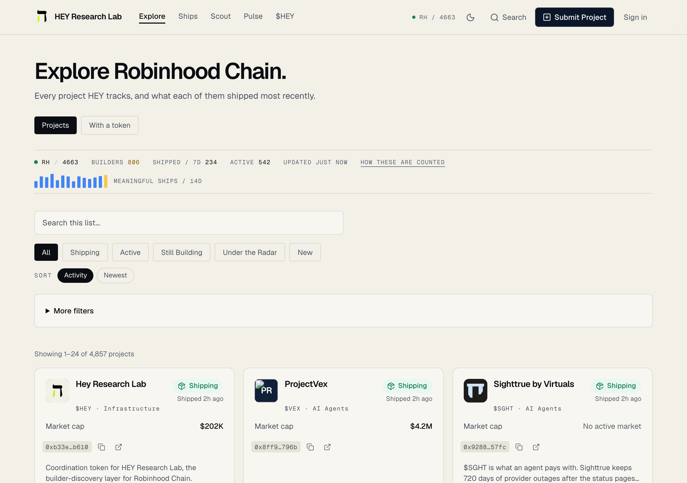
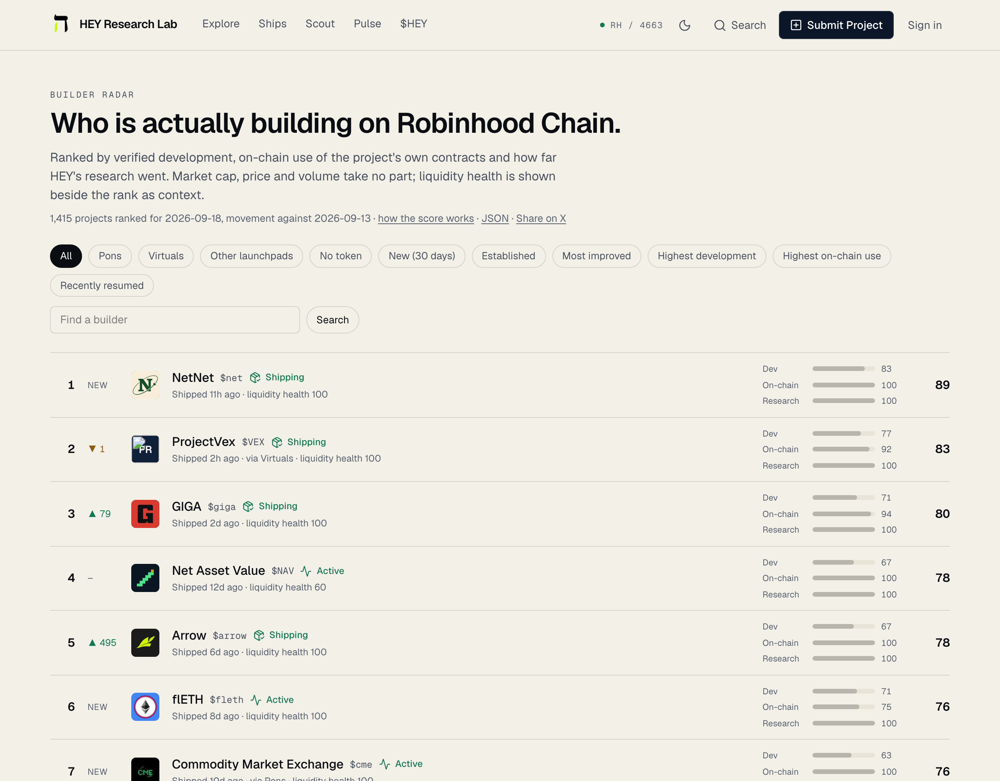
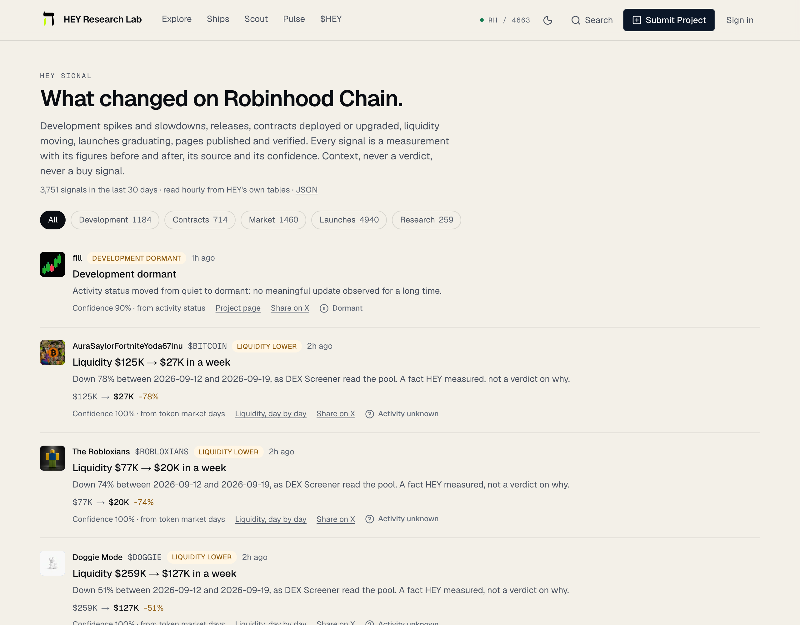
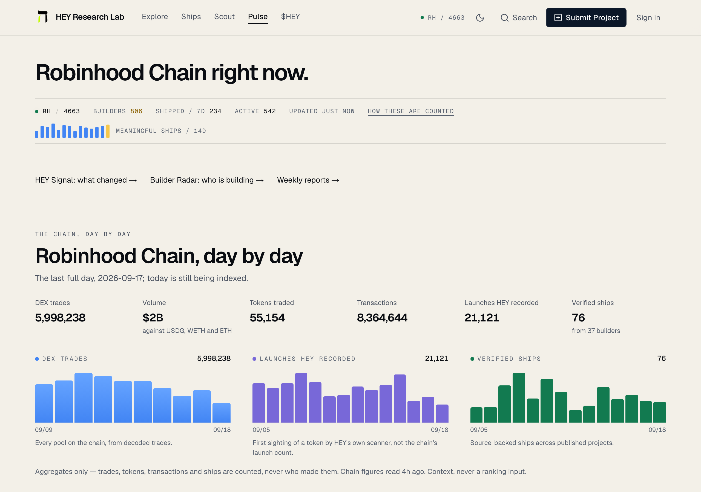
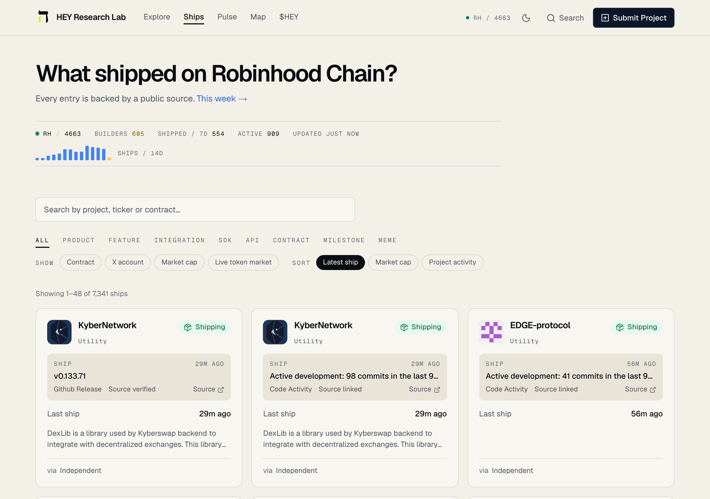
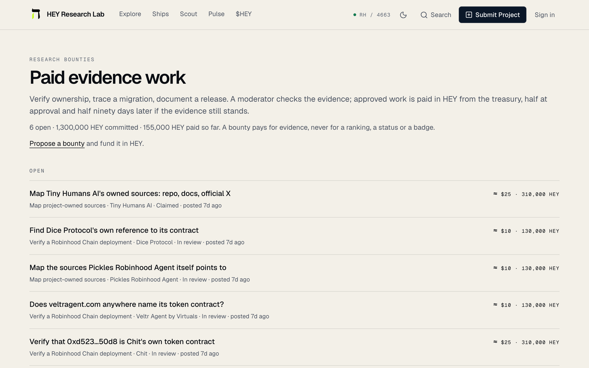
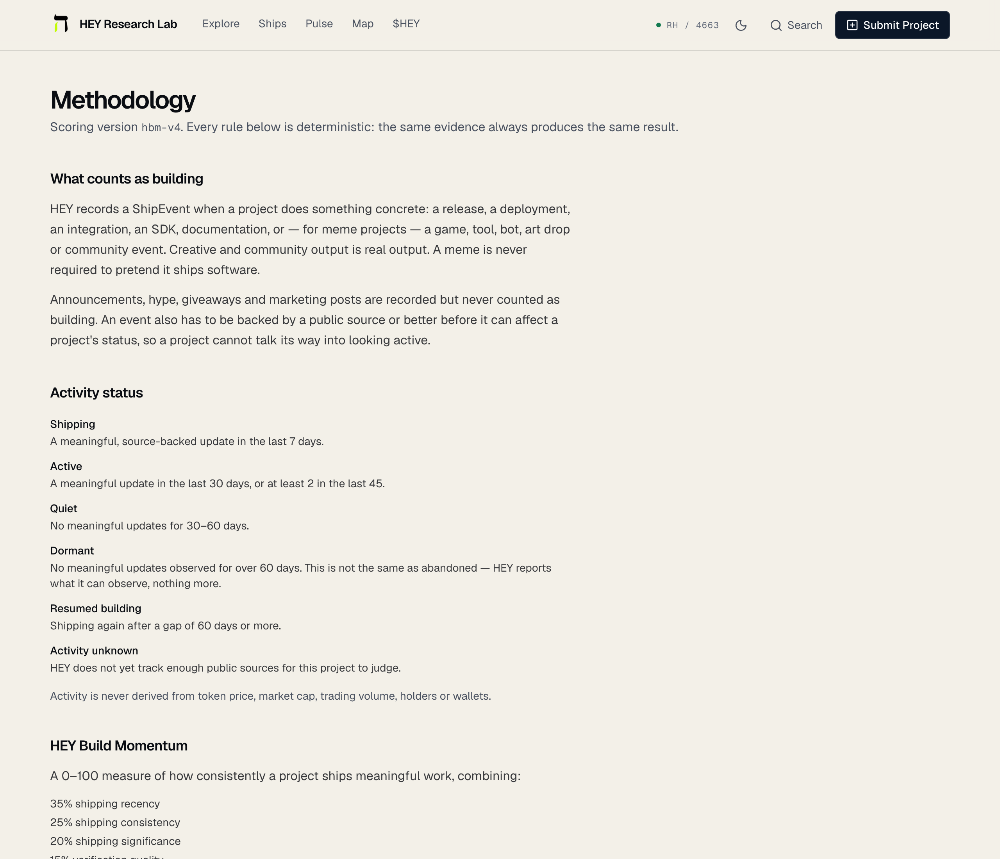
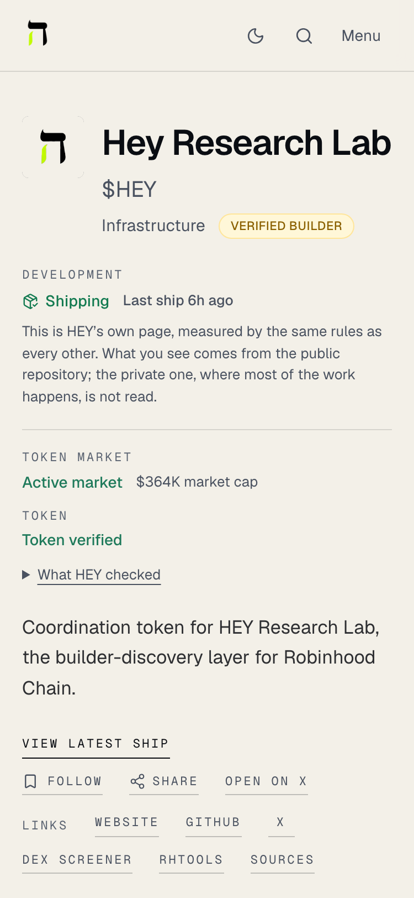

<div align="center">

# HEY Research Lab

**Find who's actually building on Robinhood Chain.**

[](https://github.com/hey-research-lab/hey-research-open/actions/workflows/ci.yml)
[](LICENSE)
[](https://nodejs.org)
[](https://www.typescriptlang.org)
[](https://heyresearch.xyz/pulse)
[](https://heyresearch.xyz)

[Site](https://heyresearch.xyz) · [Public API](docs/PUBLIC_API.md) · [MCP server](docs/MCP.md) · [Sources](docs/SOURCE_REGISTRY.md) · [Changelog](CHANGELOG.md)


</div>

## The question

Not *which wallet bought* and not *which token is pumping*, but:

> **Which projects are still building, what have they shipped, and which of them is nobody looking at?**

Every answer on HEY is a fact with the source it came from. There is no score of a project's
worth, no grade, no verdict, and the words *rug* and *scam* appear nowhere in the product — an
end-to-end test asserts it.

## What it looks like

| Explore the catalogue | One project's evidence |
| --- | --- |
|  |  |

| Builder Radar | HEY Signal |
| --- | --- |
|  |  |

<details>
<summary>More surfaces: Pulse, Ships, Scout, Bounties, Developers, Methodology, mobile</summary>

| Pulse — the chain, day by day | Ships — what landed |
| --- | --- |
|  |  |

| Scout — earn by finding evidence | Bounties — set in dollars, paid in HEY |
| --- | --- |
|  |  |

| Developers | Methodology — every rule, stated |
| --- | --- |
|  |  |

| Home, 375px | A project, 375px |
| --- | --- |
|  |  |

</details>

Captured from production on 20 September 2026.

## In this repository

This is the published half of HEY: the parts that stand on their own and are safe to read.

| Path | What it is |
| --- | --- |
| [`packages/sources`](packages/sources) | Every public-data adapter HEY reads — GitHub, Blockscout, DEX Screener, GeckoTerminal, CoinGecko, launchpads, feeds, npm — each with saved fixtures and contract tests. The tests fail on a real network call. |
| [`packages/scoring`](packages/scoring) | Activity status, Build Momentum, Still Building and Under the Radar, deterministic and versioned. They read no price and no balance, and that is tested. |
| [`packages/sdk`](packages/sdk) | `@hey-research/sdk`, the typed client over the public API. No dependencies, ESM and CJS, Node 18 or a browser. |
| [`packages/mcp-core`](packages/mcp-core) | The MCP tools, renderers, resources and prompts with no transport: fourteen read-only tools, each answer tagged FACT, DERIVED or UNKNOWN. |
| [`apps/mcp`](apps/mcp) | `@hey-research/mcp`, the stdio entry point that bundles them. Node 20. The same tools are hosted at `https://heyresearch.xyz/mcp`. |
| [`packages/config`](packages/config) | Environment schema and chain constants. |
| [`packages/ui`](packages/ui) | The presentation components — cards, chips, status, formatting. |
| [`docs/`](docs) | The public API, the MCP server, the source registry, and every data source with what it refuses and why. |

The ingestion pipeline, the quality gate, the database schema, the web app and the operations
tooling stay in the private repository.

## Quickstart

```bash
pnpm install
pnpm lint && pnpm typecheck && pnpm test     # 686 tests, no network
pnpm --filter @hey-research/sdk build        # packages/sdk/dist
pnpm --filter @hey-research/mcp build        # apps/mcp/dist/index.js
```

> **Not on npm yet** (checked 19 September 2026). The `@hey-research` scope has not been created,
> so `npm i @hey-research/sdk` and `npx -y @hey-research/mcp` do not resolve. Build from this tree
> until they do; the package names and the commands above will not change.

## Use the API

No key needed for the read API. 120 requests a minute anonymously, more with a key.

**One address, one line** — the call a trading bot makes:

```bash
curl "https://heyresearch.xyz/api/v1/scan?chain=4663&token=0xB33eb16782776b4D738c0Fd643577cb0284Db610"
```

```jsonc
{
  "found": true,
  "status": "shipping",
  "status_label": "Shipping",
  "verified_builder": true,
  "activity": { "commits_30d": 100, "releases_30d": 1, "ships_30d": 3, "last_ship": "2026-09-18" },
  "project_url": "https://heyresearch.xyz/project/hey-research-lab",
  "cta": { "label": "See the builder on HEY", "url": "…" }
}
```

A token HEY has no published page for answers `200` with `found: false`, so a bot prints nothing
rather than guessing.

**The same thing, typed:**

```ts
import { HeyClient, HeyApiError } from '@hey-research/sdk';

const hey = new HeyClient();
const card = await hey.scanCard(4663, address);
if (!card.found) return null;

for await (const project of hey.projects.items({ tab: 'still-building' })) {
  console.log(project.slug, project.lastShippedAt ?? 'no ship recorded');
}
```

A listed project with a token carries `tokenMarket` — the market state the card shows — and the
single-project route sends everything the listing does. `/api/projects/{slug}/market` adds the
contract's deployer, its pools and 1% depth, and a supply-concentration summary with no addresses
(2026-09-25).

Paging follows the API's own cursor, a `429` arrives as `HeyApiError` with `retryAfterSeconds`
and is never retried for you, and an absent field means HEY does not know — never a zero.

**For an assistant** — fourteen read-only tools over the same API, hosted or on your machine:

```bash
claude mcp add --transport http hey-research https://heyresearch.xyz/mcp

# or locally
pnpm --filter @hey-research/mcp build
claude mcp add hey-research -- node "$PWD/apps/mcp/dist/index.js"
```

Full reference: [docs/PUBLIC_API.md](docs/PUBLIC_API.md) · [docs/MCP.md](docs/MCP.md) ·
[docs/INTEGRATIONS.md](docs/INTEGRATIONS.md) — the line to render, the three answers to handle,
and the four things not to do.

## The badge

Any project HEY tracks can embed its own status. It updates itself, and it links back to the
evidence behind it.

[](https://heyresearch.xyz/project/hey-research-lab)

```markdown
[](https://heyresearch.xyz/project/<slug>)
```

`?theme=dark` and `?style=pill` are the other two looks. [docs/BADGES.md on the site](https://heyresearch.xyz/docs/badges).

## Rules that do not move

- **Building is not price.** Market cap, liquidity and volume are context and filters. Nothing in
  `packages/scoring` reads a price or a balance; a neutrality test fails the build if it ever does.
- **Paying changes nothing organic.** Bounties, sponsorships, claims and `$HEY` holdings never move
  a rank, a status or a score.
- **No wallet analytics.** No PnL, no smart-money or whale labels, no wallet profiles, no clustering
  presented as a claim about people, no copy-trading. The schema guard fails the build on the words.
  One exception, decided on 2026-09-14: a bubble map of a **single token's** largest balances on that
  token's market page. An address there is a point on a chart of one supply — never a person, never
  scored, never ranked across tokens, never an input to any status or score.
- **Absent means unknown.** A figure HEY has not measured is omitted, never published as zero.
- **Every claim carries its source.** And none of them is a buy signal.

The full rules, with the thresholds they use, are on [the methodology page](https://heyresearch.xyz/methodology).

## `$HEY`, briefly

`$HEY` (`0xB33eb16782776b4D738c0Fd643577cb0284Db610` on Robinhood Chain) pays for evidence:
research bounties set in dollars and paid in HEY, claim bonds, and priority on research requests.
Holding changes what a reader pays, when they see new research and how much API the lab serves
them. It never buys a rank, a status or a score.

## How this repository is produced

A script in the private repository copies the paths listed above, generates a types-only
`@hey/db`, refuses to publish anything that must not leave, and pushes one commit per sync. Issues
and pull requests are welcome here: a change accepted here is applied privately and comes back in
the next sync.

HEY reports what teams ship and whether a tracked token still has a market. It does not predict
prices, and nothing in it is investment advice.

MIT licence. See [CHANGELOG.md](CHANGELOG.md) for what has changed and when.
